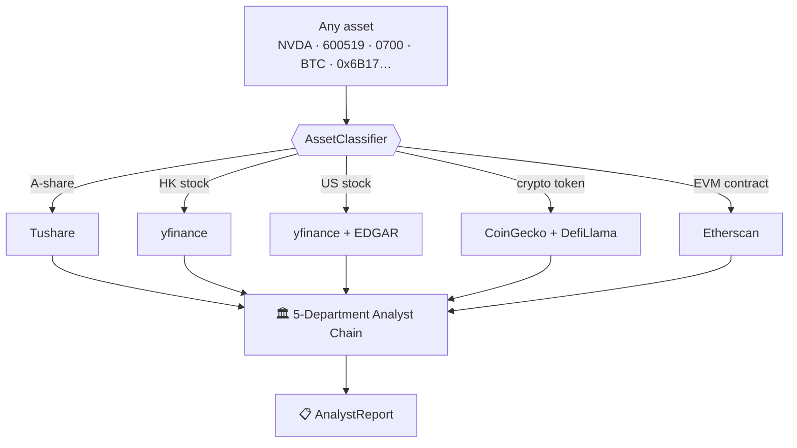
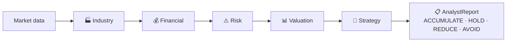

<div align="center">

# 🧠 cyberagent

### Multi-Agent LLM Investment Analysis — for *Every* Market

One team of specialist LLM agents. **Any** asset — A-shares, HK & US stocks,
crypto tokens, and on-chain contracts — analyzed through a 5-department
research chain. Bring your own LLM key.

[](https://pypi.org/project/cyberagent/)
[](https://www.python.org/)
[](LICENSE)

English | [中文](README.zh.md)

<!-- Community badges (X / Discord / WeChat / arXiv) go here once the channels are live -->

</div>

---

> ⏳ **0.0.1 placeholder** — name reserved by the core contributor. Real `0.1.0`
> shipping soon. Watch this repo for the release.

---

## What it is

**cyberagent** is a multi-agent LLM framework that mirrors the dynamics of a
real-world investment research institute. It deploys specialized LLM-powered
agents — **a 5-department analyst chain** — that collaboratively evaluate an
asset and produce a single, structured investment report.

Where most open-source analyst frameworks cover *one* market (usually US
equities), cyberagent routes **any** input through the right data adapter and
runs the **same** agent team across all of them:



> The framework is designed for research and educational purposes. Output
> quality varies with the chosen LLM, temperature, data quality, and other
> non-deterministic factors. **It is not financial, investment, or trading advice.**

---

## The Analyst Firm — 5 Departments

cyberagent decomposes the complex task of "should I care about this asset?" into
specialized roles. Each department is a separate LLM call with its own system
prompt and tools, and the chain feeds earlier reports forward so later
departments reason on top of them.



- **🏭 Industry** — sector positioning, cycle stage, competitive landscape, upstream/downstream and policy tailwinds.
- **💰 Financial** — revenue model and fundamentals for equities; token economics, cashflow / TVL for crypto.
- **⚠️ Risk** — SWOT, regulatory exposure, smart-contract risk, whale concentration, depeg / black-swan scenarios.
- **📊 Valuation** — relative multiples, FDV / MC, NVT, historical bands, entry zones.
- **🎯 Strategy** — catalyst calendar, narrative position, position sizing, and explicit invalidation triggers.

The 5 departments synthesize into one `AnalystReport` with a `final_decision`,
a `confidence` score, and the full per-department markdown.

---

## What it does

```python
from cyberagent import AnalystChain

chain = AnalystChain(llm='gemini', api_key='...')

report = await chain.analyze('NVDA')          # 美股 / US stock
report = await chain.analyze('600519')         # A股 / CN stock
report = await chain.analyze('0700')           # 港股 / HK stock
report = await chain.analyze('BTC')            # crypto
report = await chain.analyze('0x6B17...')      # EVM contract address

print(report.final_decision)                   # ACCUMULATE / HOLD / REDUCE / AVOID
print(report.confidence)                       # 0.0 - 1.0
print(report.departments['industry'].markdown)
print(report.departments['strategy'].markdown)
```

**One import, any market.** No need for one library per asset class.

---

## Install

```bash
pip install cyberagent
```

Optional integrations:
```bash
pip install 'cyberagent[langchain]'   # LangChain Tool wrapper
pip install 'cyberagent[mcp]'         # MCP server (Claude / Cursor)
```

---

## Bring your own LLM key

```python
from cyberagent import LLMAdapter

chain = AnalystChain(llm=LLMAdapter.openai(api_key='sk-...'))
chain = AnalystChain(llm=LLMAdapter.gemini(api_key='...'))
chain = AnalystChain(llm=LLMAdapter.claude(api_key='...'))
chain = AnalystChain(llm=LLMAdapter.deepseek(api_key='...'))

# Or plug in your own
class MyLLM(LLMAdapter):
    async def complete(self, system: str, user: str) -> str: ...
chain = AnalystChain(llm=MyLLM())
```

---

## Agent integrations

cyberagent is **AI-agent first** — wire the analyst chain into your own agents.

**LangChain / LangGraph**
```python
from langchain_openai import ChatOpenAI
from langgraph.prebuilt import create_react_agent
from cyberagent.langchain import analyze_asset_tool

agent = create_react_agent(ChatOpenAI(model='gpt-4o'), tools=[analyze_asset_tool])
```

**MCP server (Claude / Cursor)**
```bash
python -m cyberagent.mcp_server
```

**CLI**
```bash
cyberagent analyze NVDA --llm gemini
cyberagent analyze BTC  --depts industry,risk,strategy
```

---

## Prompts: fully open-source

All 5-department system prompts live in
[`src/cyberagent/prompts/`](src/cyberagent/prompts/) and are open-source with no
paywall. *How* to analyze a given asset is framework knowledge — the package is
fully usable end-to-end without paying for anything.

---

## Disclaimer

`final_decision`, `target_price`, `stop_loss`, and `confidence` are
**AI-generated educational outputs**, not financial advice. LLMs make mistakes;
markets are unpredictable. Do your own research. The authors and contributors are
not liable for any decisions made based on this software. See
[`docs/disclaimer.md`](docs/disclaimer.md).

---

## License

MIT. See [LICENSE](LICENSE).

<sub>Also published to the [tea Protocol](https://tea.xyz/) — see [`tea.yaml`](tea.yaml).</sub>
