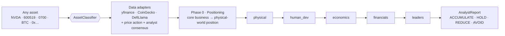

<div align="center">

# 🧠 cyberagent

### Physical-bottleneck, reverse-consensus investment analysis — for *every* market

A chain of LLM agents that traces any asset down to the **physical constraint**
that caps its industry, checks whether the market has **already priced it**, and
**refuses to chase a narrative-driven top**. Stocks (A-share / HK / US) and
crypto (token / contract). Bring your own LLM key.

[](https://pypi.org/project/cyberagent/)
[](https://www.python.org/)
[](LICENSE)

### 🌐 Language / 语言

**English** &nbsp;|&nbsp; [简体中文](README.zh.md)

</div>

---

> 🚧 **Active development.** The analysis engine works end-to-end today; the
> public API may still shift before a tagged `0.1.0`.

---

## What makes it different

Most open-source "AI analyst" frameworks ask *"is this a good company?"* and
return a textbook SWOT. cyberagent asks a sharper, **falsifiable, reverse-consensus**
question, in a fixed order:

> **Physical bottleneck → uniqueness → commercialization → financial elasticity → consensus correction**
>
> *Where is the physical constraint in this asset's supply chain? Is it unique?
> Can it be monetized? Does it have non-linear financial elasticity? And has the
> market already priced it in?*

It is built on one idea from Leopold Aschenbrenner's *[Situational Awareness](https://situational-awareness.ai/)*:
**AI scaling is a massive *industrial* process**, bottlenecked by physical inputs —
power, transformers, HBM, CoWoS packaging, specific materials. cyberagent
operationalizes that thesis: it walks the supply chain down to the link
*"no amount of money can buy"*, and then applies hard anti-narrative discipline so
it doesn't mistake a headline-driven spike for an opportunity.

It does **not** predict prices. It produces facts, a falsifiable logic chain, and
monitorable physical signals — the final decision is yours.

---

## How it works



**Phase 0 — Positioning.** From the fundamentals, lock down what the company
actually sells, then pin it to a specific layer of the physical / AI supply chain
(materials → substrate → equipment → packaging → device → module → system → end
demand) and a concrete machine (e.g. a *GB300 NVL72 rack*, a *1.6T optical link*).

**Five departments**, run in sequence, each reading the upstream reports:

| Dept | `key` | What it does |
|---|---|---|
| 🪨 Physical World | `physical` | Locate the binding bottleneck on the SA ladder (power > CoWoS/HBM > raw logic); classify the asset as **owner / adjacent / derivative / none**. Non-owner ⇒ downgraded, scarcity-rent logic forbidden. |
| 🌍 Human Development | `human_dev` | Place the demand on the AGI / OOM arc — early (runway left) or mature/peaked? |
| 💱 Economics | `economics` | ore-seller vs processor; **decompose the price move into earnings-growth vs multiple-expansion**; detect valuation-framework switches; is it *already priced* (Gray Rhino vs loud consensus)? |
| 📈 Company Financials | `financials` | Fundamentals + financial elasticity (linear vs non-linear); attribute earnings anomalies *before* flagging them. |
| 🎯 Leaders & Verdict | `leaders` | Two-axis verdict — **bottleneck identity (a) vs pricing position (b)** — steelman + Munger inversion, monitorable exit signals, final decision. |

### The discipline (why it won't chase a top)

This is the part textbook frameworks skip:

- **Real-time grounding** — with Gemini it *searches why a price moved* (the catalyst, who said what), instead of trusting model memory.
- **Price-action guardrail** — the data layer flags parabolic / near-high moves; a stock that doubled in days on one headline is an **AVOID / observe** form, never a buy.
- **Evidence ladder** — every key claim is tagged `Confirmed / Inferred / Weak`; a load-bearing `Inferred` claim caps the confidence.
- **Two independent axes** — *"is it a bottleneck"* (classification) and *"should you buy it here"* (pricing) are never conflated. A non-bottleneck can be a fine trade at a price; a real bottleneck at a top can be a bad one.
- **Honest "too late"** — parabolic move + extreme valuation + loud consensus ⇒ the label is *"too late / top"*, not an opportunity.

> Educational and research use only. Output quality varies with the model, data,
> and many non-deterministic factors. **This is not financial, investment, or
> trading advice.**

---

## Quickstart

```python
from cyberagent import AnalystChain

chain = AnalystChain(llm="gemini", api_key="...", lang="en")  # grounding on by default

report = await chain.analyze("NVDA")     # US · or 600519 (A-share) / 0700 (HK) / BTC / 0x6B17...

print(report.final_decision)             # ACCUMULATE / HOLD / REDUCE / AVOID
print(report.confidence)                 # 0.0 - 1.0
print(report.positioning)                # Phase 0 — core business + physical position
print(report.departments["physical"].markdown)
print(report.departments["leaders"].markdown)
```

**One import, any market.** Pick the report language with `lang="zh"` / `"en"`;
the whole report is generated in it.

---

## Install

```bash
pip install 'cyberagent[stocks,gemini]'   # recommended: stock data + grounded Gemini
```

Extras: **`stocks`** (yfinance) · **`gemini` / `openai` / `claude`** (providers) ·
**`web`** (local UI). The bare `pip install cyberagent` is the zero-dependency core.

## Set up your API key

cyberagent is **bring-your-own-key**. Gemini is the default and the only provider
with real-time grounding — recommended.

**1. Get a key** — Gemini is free to start:
[aistudio.google.com/app/apikey](https://aistudio.google.com/app/apikey).
(Other providers: [OpenAI](https://platform.openai.com/api-keys) ·
[Anthropic](https://console.anthropic.com/) ·
[DeepSeek](https://platform.deepseek.com/).)

**2. Configure it** — copy the template and paste your key:

```bash
cp .env.example .env
# then edit .env:   GOOGLE_API_KEY=your_key_here
```

The CLI and web UI auto-load `.env`. In code you can pass it directly instead:

```python
AnalystChain(llm="gemini", api_key="your_key_here")
```

**3. Run it** — `cyberagent` (interactive) or `cyberagent serve` (web). The model
picker shows a ✓ next to every key it found in your `.env`.

## Bring your own LLM key

Gemini is the default (and the only provider with real-time grounding). You can
also pass any provider or a custom adapter:

```python
from cyberagent import AnalystChain, LLMAdapter, MockLLM

AnalystChain(llm="gemini",   api_key="...")          # default, grounded
AnalystChain(llm="openai",   api_key="sk-...")
AnalystChain(llm="claude",   api_key="...")
AnalystChain(llm="deepseek", api_key="...")
AnalystChain(llm=MockLLM())                           # offline, no key — try the flow

class MyLLM(LLMAdapter):
    async def complete(self, system: str, user: str) -> str: ...
AnalystChain(llm=MyLLM())
```

Keys are read from the environment / a local `.env` (see [`.env.example`](.env.example)).

## CLI & local web page

```bash
cyberagent                                   # interactive: pick language + model, then a symbol
cyberagent analyze NVDA --llm gemini --lang en
cyberagent analyze BTC  --depts physical,economics,leaders   # subset, faster
cyberagent serve                             # local web UI at http://127.0.0.1:8000
```

The CLI and web page show a model picker that auto-matches the API key found in
your `.env` (✓ / ✗), live per-department progress, and the rendered report.

---

## Use as a Claude Skill — no install

The whole methodology is also packaged as a self-contained **Claude Skill** in
[`SKILL.md`](SKILL.md). Drop it into Claude Code / Cursor (or any agent that loads
skills) and ask it to analyze an asset — it runs the same physical-bottleneck chain
in pure-prompt form, no Python required. The package adds live data, real-time
grounding, and the CLI / web UI on top.

## Methodology & prompts — fully open

There is no paywall. *How* to hunt a physical bottleneck is framework knowledge,
not alpha. The complete system prompts live in
[`src/cyberagent/prompts/departments.py`](src/cyberagent/prompts/departments.py),
and the *Situational Awareness* anchor (the physical-bottleneck ladder + the OOM
development arc) is distilled in [`references/sa-canon.md`](references/sa-canon.md).

---

## Roadmap

- [ ] LangChain / LangGraph tool wrapper
- [ ] MCP server (Claude / Cursor)
- [ ] EDGAR (US filings) + Tushare (A-share) + Etherscan (EVM) adapters
- [ ] Segment-level chains for conglomerates
- [ ] Structured per-department gate verdicts (machine-enforced "stop")

---

## Disclaimer

`final_decision`, `confidence`, and the department reports are **AI-generated
educational outputs**, not financial advice. LLMs make mistakes; markets are
unpredictable. Do your own research. The authors and contributors are not liable
for any decision made based on this software. See [`docs/disclaimer.md`](docs/disclaimer.md).

## License

MIT. See [LICENSE](LICENSE).

<sub>Also published to the [tea Protocol](https://tea.xyz/) — see [`tea.yaml`](tea.yaml).</sub>
