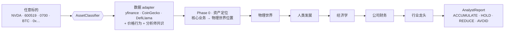

<div align="center">

# 🧠 cyberagent

### 物理瓶颈 · 反共识投资分析框架 —— 面向*所有市场*

一条 LLM 智能体链，把任意标的一层层拆到卡住它所在产业的**物理约束**，核对市场
**是否已经定价**，并**拒绝追逐叙事驱动的尖顶**。覆盖股票（A 股 / 港股 / 美股）与
加密（代币 / 合约）。自带 LLM key 即可运行。

[](https://pypi.org/project/cyberagent/)
[](https://www.python.org/)
[](LICENSE)

### 🌐 Language / 语言

[English](README.md) &nbsp;|&nbsp; **简体中文**

</div>

---

> 🚧 **活跃开发中。** 分析引擎已能端到端跑通；公开 API 在打 `0.1.0` 标签前仍可能调整。

---

## 它和别的有什么不一样

市面多数开源「AI 分析师」框架问的是*「这家公司好不好」*，产出一份教科书式 SWOT。
cyberagent 问的是一个更锋利、**可证伪、反共识**的问题，且严格按顺序：

> **物理瓶颈 → 唯一性 → 商业化 → 财务弹性 → 共识修正**
>
> *这个标的的供应链被哪个物理量卡住？它唯一吗？能变现吗？有没有非线性财务弹性？
> 市场是不是已经把它定价了？*

它建立在 Aschenbrenner《[Situational Awareness](https://situational-awareness.ai/)》
的一个核心判断上：**AI 扩张是一个大规模*工业*进程**，被物理输入卡住——电力、变压器、
HBM、CoWoS 先进封装、特定材料。cyberagent 把这个 thesis 落地：沿供应链一直拆到
*「再多钱也买不到」*的环节，再施加强硬的反叙事纪律，避免把头条驱动的暴涨误当机会。

它**不预测价格**。它给的是事实、可证伪的逻辑链、可监控的物理信号——最终决策由你做出。

---

## 它怎么工作

这条链是一台**望远镜**——从物理现实一路缩放到可操作的具体标的，每一步是一次带 grounding
的 LLM 调用（都读上游报告）：

> **资产定位 → 物理世界 → 人类发展 → 经济学 → 公司财务 → 行业龙头与判定**

这台望远镜，正是上面那条五步*方法*链（瓶颈 → 唯一性 → 商业化 → 弹性 → 共识）的实际执行方式。



**Phase 0 · 资产定位。** 先用基本面锁定这家公司到底卖什么，再把它钉到物理 / AI
供应链的具体一层（材料 → 衬底 → 设备 → 封装 → 器件 → 模组 → 系统 → 终端）和一台
具体机器（如 *GB300 NVL72 机架*、*1.6T 光链*）。

**五个部门**顺序运行，每个都读上游报告：

| 部门 | `key` | 职责 |
|---|---|---|
| 🪨 物理世界 | `physical` | 在 SA 瓶颈阶梯上定位绑定约束（电力 > CoWoS/HBM > 裸逻辑）；把标的分类为 **owner / adjacent / derivative / none**。非 owner ⇒ 降级，禁用稀缺租金逻辑。 |
| 🌍 人类发展 | `human_dev` | 把需求放到 AGI / OOM 弧线上——早期（还有跑道）还是成熟/见顶？ |
| 💱 经济学 | `economics` | ore-seller vs processor；**把涨幅拆成盈利增长 vs 倍数扩张**；识别估值框架切换；是否*已被定价*（Gray Rhino vs 响亮共识）？ |
| 📈 公司财务 | `financials` | 基本面 + 财务弹性（线性 vs 非线性）；盈利异常先归因再当红旗。 |
| 🎯 行业龙头 | `leaders` | 两轴判定——**瓶颈身份(a) vs 定价位置(b)**——steelman + Munger 反向、可监控退出信号、最终决策。 |

### 纪律（它为什么不追尖顶）

这正是教科书框架跳过的部分：

- **实时搜索** —— 用 Gemini 时会*搜索价格为什么动*（催化剂、谁说的），而不是信模型记忆。
- **价格行为护栏** —— 数据层标记抛物线 / 贴近高点的异动；几天内靠一句话翻倍的股票是**回避/观察**形态，不是买入形态。
- **证据分级** —— 每个关键论断打 `Confirmed / Inferred / Weak` 标签；承重的 `Inferred` 会封顶置信度。
- **两个独立维度** —— *「是不是瓶颈」*（分类）与*「该不该在这个价位买」*（定价）绝不混为一谈。非瓶颈在某价位也能是好交易；真瓶颈在尖顶也可能是坏交易。
- **诚实标「晚了」** —— 抛物线 + 估值极值 + 共识响亮 ⇒ 标签是*「晚了/尖顶」*，不是机会。

> 仅供教育与研究用途。输出质量受模型、数据及诸多非确定因素影响。**不构成任何
> 财务、投资或交易建议。**

---

## 快速开始

```python
from cyberagent import AnalystChain

chain = AnalystChain(llm="gemini", api_key="...", lang="zh")  # 默认开启 grounding

report = await chain.analyze("NVDA")     # 美股 · 或 600519(A股) / 0700(港股) / BTC / 0x6B17...

print(report.final_decision)             # ACCUMULATE / HOLD / REDUCE / AVOID
print(report.confidence)                 # 0.0 - 1.0
print(report.positioning)                # Phase 0 — 核心业务 + 物理位置
print(report.departments["physical"].markdown)
print(report.departments["leaders"].markdown)
```

**一次 import，覆盖任意市场。** 用 `lang="zh"` / `"en"` 选报告语言，整份报告都按它生成。

---

## 安装

```bash
pip install 'cyberagent[stocks,gemini]'   # 推荐：股票数据 + 带 grounding 的 Gemini
```

可选 extra：**`stocks`**（yfinance）· **`gemini` / `openai` / `claude`**（provider）·
**`web`**（本地网页）。裸 `pip install cyberagent` 是零依赖核心。

## 设置 API key

cyberagent 是**自带 key**。Gemini 是默认、也是唯一带实时 grounding 的 provider——推荐。

**1. 拿一个 key** —— Gemini 免费起步：
[aistudio.google.com/app/apikey](https://aistudio.google.com/app/apikey)。
（其它 provider：[OpenAI](https://platform.openai.com/api-keys) ·
[Anthropic](https://console.anthropic.com/) ·
[DeepSeek](https://platform.deepseek.com/)。）

**2. 配置它** —— 复制模板，把 key 填进去：

```bash
cp .env.example .env
# 然后编辑 .env：   GOOGLE_API_KEY=你的key
```

CLI 和网页会自动加载 `.env`。在代码里也可以直接传：

```python
AnalystChain(llm="gemini", api_key="你的key")
```

**3. 跑起来** —— `cyberagent`（交互式）或 `cyberagent serve`（网页）。模型选择器会在
每个 `.env` 里找到的 key 旁边显示 ✓。

## 自带 LLM key

Gemini 是默认（也是唯一带实时 grounding 的 provider）。也可传任意 provider 或自定义 adapter：

```python
from cyberagent import AnalystChain, LLMAdapter, MockLLM

AnalystChain(llm="gemini",   api_key="...")          # 默认，带搜索
AnalystChain(llm="openai",   api_key="sk-...")
AnalystChain(llm="claude",   api_key="...")
AnalystChain(llm="deepseek", api_key="...")
AnalystChain(llm=MockLLM())                           # 离线、无 key —— 体验流程

class MyLLM(LLMAdapter):
    async def complete(self, system: str, user: str) -> str: ...
AnalystChain(llm=MyLLM())
```

key 从环境变量 / 本地 `.env` 读取（见 [`.env.example`](.env.example)）。

## CLI 与本地网页

```bash
cyberagent                                   # 交互式：选语言 + 选模型，再输代码
cyberagent analyze NVDA --llm gemini --lang zh
cyberagent analyze BTC  --depts physical,economics,leaders   # 子集，更快
cyberagent serve                             # 本地网页 http://127.0.0.1:8000
```

CLI 和网页都有模型选择器，自动匹配 `.env` 里找到的 key（✓ / ✗）、逐部门实时进度、渲染报告。

---

## 作为 Claude Skill 使用 —— 无需安装

整套方法论还被打包成一个自包含的 **Claude Skill**，见 [`SKILL.md`](SKILL.md)。把它丢进
Claude Code / Cursor（或任何能加载 skill 的 agent），让它分析一个标的——它会用纯
prompt 形态跑同一条物理瓶颈链，不需要 Python。Python 包在此之上加了实时数据、grounding
和 CLI / 网页。

## 方法论与 prompts —— 完全开源

没有付费墙。*怎么*狩猎物理瓶颈是框架知识，不是 alpha。完整的 system prompts 在
[`src/cyberagent/prompts/departments.py`](src/cyberagent/prompts/departments.py)；
《Situational Awareness》的锚（物理瓶颈阶梯 + OOM 发展弧线）提炼在
[`references/sa-canon.md`](references/sa-canon.md)。

---

## 路线图

- [ ] LangChain / LangGraph tool 封装
- [ ] MCP server（Claude / Cursor）
- [ ] EDGAR（美股文件）+ Tushare（A 股）+ Etherscan（EVM）adapter
- [ ] 多分部公司的分部级链
- [ ] 结构化的部门级闸门裁决（机器强制「停」）

---

## 免责声明

`final_decision` / `confidence` 与各部门报告均为 **AI 生成的教育性输出**，不构成投资建议。
LLM 会犯错，市场不可预测，请自行研究。作者与贡献者不对基于本软件的任何决策负责。
详见 [`docs/disclaimer.md`](docs/disclaimer.md)。

## 协议

MIT，见 [LICENSE](LICENSE)。

<sub>同时发布到 [tea 协议](https://tea.xyz/)，见 [`tea.yaml`](tea.yaml)。</sub>
