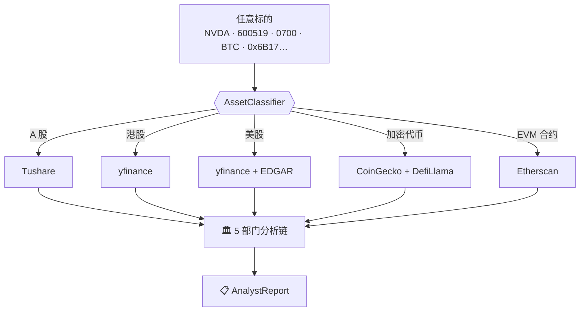
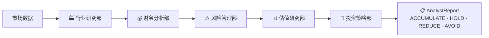

<div align="center">

# 🧠 cyberagent

### 面向*所有市场*的多智能体 LLM 投资分析框架

一支专业 LLM 智能体团队，分析**任意**标的——A 股、港股、美股、加密代币、链上合约——
全部走同一套 **5 部门研究链**。自带 LLM key 即可运行。

[](https://pypi.org/project/cyberagent/)
[](https://www.python.org/)
[](LICENSE)

[English](README.md) | 中文

</div>

---

> ⏳ **0.0.1 占位版** — 包名已由 core contributor 锁定，正式 `0.1.0` 即将发布，关注本仓库。

---

## 这是什么

**cyberagent** 是一个多智能体 LLM 框架，模拟真实投研院的运作：部署一支专业的
LLM 智能体团队——**5 部门链式分析**——协同评估一个标的，产出一份结构化投资报告。

市面上多数开源分析框架只覆盖**单一**市场（通常是美股）。cyberagent 把**任意**输入
路由到对应的数据 adapter，再用**同一套**智能体团队跑通所有市场：



> 本框架仅用于研究与教育目的。输出质量受所选 LLM、温度、数据质量等非确定因素影响。
> **不构成任何财务、投资或交易建议。**

---

## 投研院 — 5 个部门

cyberagent 把「这个标的值不值得关注」这个复杂任务拆解为专业角色。每个部门是一次
独立的 LLM 调用，带自己的 system prompt 和工具；链式编排会把前序部门的报告向后传递，
让后置部门在其基础上推理。



- **🏭 行业研究部** — 赛道定位、周期阶段、竞争格局、上下游与政策。
- **💰 财务分析部** — 股票看营收与基本面；加密看代币经济、现金流 / TVL。
- **⚠️ 风险管理部** — SWOT、监管、合约风险、巨鲸集中度、脱锚 / 黑天鹅情景。
- **📊 估值研究部** — 相对估值、FDV / MC、NVT、历史区间、建仓区间。
- **🎯 投资策略部** — 催化剂日历、叙事位置、仓位管理、明确的止损触发条件。

5 个部门最终综合成一份 `AnalystReport`，含 `final_decision`、`confidence` 与各部门完整 markdown。

---

## 用法

```python
from cyberagent import AnalystChain

chain = AnalystChain(llm='gemini', api_key='...')

report = await chain.analyze('NVDA')          # 美股
report = await chain.analyze('600519')         # A 股
report = await chain.analyze('0700')           # 港股
report = await chain.analyze('BTC')            # 加密
report = await chain.analyze('0x6B17...')      # EVM 合约地址

print(report.final_decision)                   # ACCUMULATE / HOLD / REDUCE / AVOID
print(report.departments['industry'].markdown)
```

**一次 import，覆盖任意市场。**

---

## 安装

```bash
pip install cyberagent
pip install 'cyberagent[langchain]'   # LangChain Tool
pip install 'cyberagent[mcp]'         # MCP server（Claude / Cursor）
```

---

## 自带 LLM key

```python
from cyberagent import LLMAdapter

chain = AnalystChain(llm=LLMAdapter.openai(api_key='sk-...'))
chain = AnalystChain(llm=LLMAdapter.gemini(api_key='...'))
chain = AnalystChain(llm=LLMAdapter.claude(api_key='...'))
chain = AnalystChain(llm=LLMAdapter.deepseek(api_key='...'))
```

---

## Prompts 全部开源

5 个部门的 system prompts 全部在 [`src/cyberagent/prompts/`](src/cyberagent/prompts/)，
开源、无付费墙。开箱即用、端到端可跑，无需为任何东西付费。

---

## 免责声明

`final_decision` / `target_price` / `stop_loss` / `confidence` 均为 **AI 生成的教育性输出**，
不构成投资建议。LLM 会犯错，市场不可预测，请自行研究。详见
[`docs/disclaimer.md`](docs/disclaimer.md)。

---

## 协议

MIT，见 [LICENSE](LICENSE)。

<sub>同时发布到 [tea 协议](https://tea.xyz/)，见 [`tea.yaml`](tea.yaml)。</sub>
